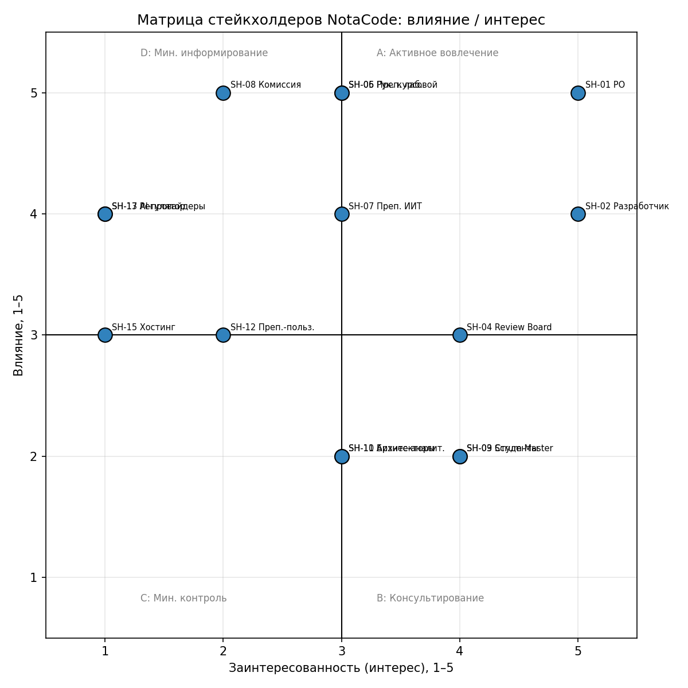

Министерство образования Республики Беларусь
Учреждение образования «Белорусский государственный университет информатики и радиоэлектроники»
Факультет повышения квалификации и переподготовки
Кафедра микропроцессорных систем и сетей

# ОТЧЁТ
по практическому занятию №1
по дисциплине «Управление проектами»
на тему «Разработка концепции проекта»

Проект: **NotaCode** — веб-IDE «diagram as code» для формальных нотаций моделирования

Слушатель гр. 60121 — `<ФИО>`
Руководитель — И.В. Кашникова

Минск, 2026

---

## Раздел 1. Обоснование проекта (Business Case)

### 1.1 Ключевые вопросы (модель 5W)

| Элемент | Ключевые вопросы | Ваш ответ |
|---|---|---|
| WHAT? | Что делаем? Какую проблему решаем? | Веб-IDE «diagram as code»: собственный DSL для строгих нотаций (UML, BPMN, ERD, IDEF0/1X/3, DFD, сети Петри) с проверкой правил, версионированием и экспортом — решает проблемы P-01…P-06 (см. 1.2) |
| WHO? | Для кого? Кто заказчик? | Заказчик/Product Owner — автор проекта; целевые сегменты: студенты технических специальностей, бизнес- и системные аналитики, архитекторы ПО, преподаватели |
| WHY? | Почему это важно? Почему сейчас? | Ручное построение диаграмм строгих нотаций трудоёмко; существующие diagram-as-code инструменты не покрывают структурные нотации; нужно закрыть курсовую и лабораторные ИТиВП ч.2 к 06.12.2026 |
| WHEN? | Когда завершаем? (MVP и релиз) | MVP — конец спринта S10 (06.12.2026); защита курсовой — 18.12.2026 |
| WHERE? | Где используется? (платформы, браузеры) | PWA, современные браузеры (Chrome/Edge/Firefox), десктоп и планшет |

### 1.2 Бизнес-окружение проекта

Проект связан со стратегией автора: закрыть одновременно три учебные задачи (курсовая работа ИТиВП ч.2, лабораторные работы ИТиВП, дисциплина ИИТ с коммерциализацией) на одной кодовой базе. Рыночное условие — существующие diagram-as-code инструменты (PlantUML, Mermaid, D2, Graphviz) не содержат профилей строгих структурных нотаций (IDEF0, IDEF1X, IDEF3, DFD), а специализированные CASE-средства (Ramus, BPwin, Sparx EA) — платные настольные приложения без Git-версионирования. Проект нужен сейчас, поскольку семестр (осень 2026) жёстко ограничивает срок до защиты.

**Проблемы → Решения:**

| № | Проблема (как есть сейчас) | Решение (что сделает продукт) |
|---|---|---|
| 1 | Ручное построение диаграмм строгих нотаций трудоёмко: BPMN, IDEF0, IDEF3, DFD строятся перетаскиванием фигур, при изменении модели связи и раскладка перестраиваются вручную | Диаграмма описывается на DSL, раскладка выполняется автоматически (elkjs) |
| 2 | Diagram-as-code инструменты не покрывают структурные нотации (нет профилей IDEF0, IDEF1X, IDEF3, DFD, сетей Петри) | Единая грамматика DSL с профилями всех нотаций (ключ `нотация.тип.вариант`) |
| 3 | Правила нотации не проверяются графическими редакторами (ICOM-роли IDEF0, баланс DFD, кардинальности ERD) | Автоматическая валидация по правилам выбранной нотации с диагностикой по номеру строки |
| 4 | Специализированные CASE-средства ограничены: платные, без текстового представления модели, без Git-версионирования | Веб-приложение с версионированием (коммиты, diff, откат), бесплатный тариф |
| 5 | Отсутствует связь «текст ↔ изображение»: неизвестно, какая строка описания соответствует элементу | Кросс-подсветка «строка кода ↔ элемент холста» |
| 6 | История изменений диаграммы не ведётся: бинарные/XML-файлы редакторов не дают построчного diff и отката | Неизменяемые коммиты, diff двух версий, undo/redo |

### 1.3 SMART-цель проекта

| Критерий | Ваш ответ |
|---|---|
| S (Что конкретно делаем?) | Функции Must (см. раздел 2.1) работают целиком от UI до сервиса |
| M (Как измерим успех?) | 100 % историй Must в статусе Done; 0 «кнопок-пустышек» по UI-чек-листу |
| A (Почему это достижимо?) | Walking skeleton выполнен в подготовительном спринте S0; далее 10 спринтов по 1 неделе; WIP ≤ 2 |
| R (Как решает проблемы бизнеса?) | Закрывает проблемы P-01…P-06 и одновременно курсовую работу, лабораторные ИТиВП и задел для коммерциализации (дисциплина ИИТ) |
| T (К какому сроку сделаем?) | 06.12.2026 (конец спринта S10) |

**Итоговая SMART-цель проекта (одно предложение):**
До 06.12.2026 выпустить MVP NotaCode в полном объёме Must (по MoSCoW, раздел 2.1) со 100 % тестовым покрытием, что подтверждается прохождением 100 % историй Must в статусе Done и отсутствием «кнопок-пустышек» в UI-чек-листе.

### 1.4 Правила приёмки

Критерии, когда заказчик (сам автор в роли Product Owner) примет работу:
1. Код находится в `main` через Pull Request, CI проходит зелёным.
2. Покрытие тестами — 100 % по строкам, ветвям и функциям для изменённого пакета.
3. Ноль комментариев в коде (по линтеру), ruff/mypy/ESLint/Prettier без замечаний.
4. Функция работает целиком от UI до сервиса — нет «кнопок-пустышек».
5. Review Board (`nc-*` агенты) не имеет замечаний уровня High.

### 1.5 Допущения проекта

| № | Допущение | Влияние на проект (если не сбудется) |
|---|---|---|
| 1 | Семестр заканчивается ≈20.12.2026, защита курсовой — 18.12.2026 | Смещение всех вех и спринтов S0–S12, пересмотр календарного плана |
| 2 | Бесплатные тарифы хостинга/БД (Render, Netlify, Neon, CloudAMQP, Upstash) достаточны для демо-стенда | Потребуется платный тариф либо сокращение нагрузочного тестирования |
| 3 | AI-провайдеры дают достаточно бесплатных ключей/квоты для 4 режимов ассистента | AI остаётся в режиме заглушки дольше запланированного (см. риск в реестре рисков) |

---

## Раздел 2. Содержание и границы проекта (Scope)

### 2.1 MoSCoW-приоритизация требований

| Приоритет | Расшифровка | Требования вашего проекта |
|---|---|---|
| **Must have** | Без этого система не имеет смысла. Сделать обязательно. | 1. Редактор DSL с подсветкой и подсказками; 2. Run (рендер по кнопке); 3. Холст с сеткой, zoom/pan; 4. Подсветка элемент↔строки кода; 5. Светлая и тёмная темы; 6. Выбор нотации и типа диаграммы; 7. Валидация и тосты Error/Warning/OK; 8. Terminal и Problems; 9. Шаблоны (просмотр/копирование/вставка); 10. Вкладка документации; 11. AI-ассистент (заглушка, 4 режима); 12. Сохранение на устройство/БД/GitHub/Google Drive; 13. Экспорт SVG/PNG/формат нотации/код/проект; 14. UI по образцу VS Code/draw.io; 15. Activity bar; 16. Нотации волны 1 |
| **Should have** | Важно, но можно отложить на второй релиз. | 1. Вход и регистрация; 2. История версий, diff, откат; 3. Undo/redo; 4. Автоисправление (quick fix); 5. Импорт; 6. Полный статус-бар; 7. RU/EN |
| **Could have** | Хорошо бы, если останутся ресурсы. | 1. Автообновление при вводе; 2. Автосохранение; 3. Нотации волн 2–3; 4. Kroki и альтернативные движки; 5. «Открыть в draw.io»; 6. PWA-офлайн; 7. Центр уведомлений; 8. Плагины |
| **Won't have** | Сознательно не делаем в этом проекте. | 1. Изображение → диаграмма; 2. Редактирование на холсте с записью в код; 3. Несколько открытых вкладок; 4. Совместная работа; 5. Kubernetes-прод |

**Проверка правила «Must ≤ 60 %»:** Must = 16 пунктов, Should = 7, Could = 8, Won't = 5 → всего 36 пунктов, доля Must = 16/36 ≈ 44 % — правило выполнено, переноса пунктов не требуется.

### 2.2 Исключения (что НЕ входит в проект)

- НЕ входит: распознавание диаграммы по загруженному изображению (генерация DSL из картинки).
- НЕ входит: прямое редактирование элементов на холсте с автоматической записью изменений в код (только редактирование через DSL).
- НЕ входит: одновременная работа с несколькими открытыми вкладками/файлами в одном окне IDE.
- НЕ входит: совместное (многопользовательское, real-time) редактирование одной диаграммы.
- НЕ входит: развёртывание в production-Kubernetes-кластере (только Docker Compose для локального/демо-окружения).

---

## Раздел 3. Ограничения проекта

| Категория | Конкретные ограничения вашего проекта |
|---|---|
| Технические | React 19 + TypeScript + Vite (PWA), Monaco Editor, elkjs · Node.js + Express (Gateway, Sequelize, Mongoose, Socket.IO) · Python + FastAPI (Workspace, Language, Conversion, AI, Integration) · PostgreSQL, MongoDB, Redis, RabbitMQ, MinIO · Docker, GitHub Actions |
| Правовые / Законодательные | Закон Республики Беларусь от 07.05.2021 № 99-З «О защите персональных данных» — необходима политика обработки ПД при запуске регистрации пользователей |
| Организационные | Один разработчик + AI-ассистент; роль Review Board выполняют AI-агенты `nc-*` (архитектор, clean-code-guardian, coverage-guardian, эксперты по нотациям, labs-compliance, security); каждый PR проходит их проверку |
| Временные | Старт подготовительного спринта S0 — 21.09.2026; MVP — 06.12.2026 (конец S10); защита курсовой — 18.12.2026 |
| Бюджетные | На этапе MVP используются только бесплатные тарифы хостинга/БД/AI-провайдеров (Render, Netlify, Neon, CloudAMQP, Upstash, бесплатные ключи LLM) |
| Пользовательские | Интерфейс ориентирован на пользователей, знакомых с VS Code и draw.io; собственный UX не изобретается; локализация RU/EN — только в Should have |

---

## Раздел 4. Задачи разработки (декомпозиция цели)

Логика: SMART-цель проекта разбита на 13 крупных этапов (по эпикам E0–E13 продуктового бэклога), каждый — на 2–3 конкретные задачи.

```
1. Формулирование и планирование
   1.1 Написать бизнес-документацию (концепция, стейкхолдеры, SMART, BRD)
   1.2 Спроектировать архитектуру (C4, ADR, модель данных)
   1.3 Составить WBS, реестр рисков, план спринтов
2. Фундамент (E0)
   2.1 Поднять монорепо и CI
   2.2 Настроить Docker Compose
   2.3 Реализовать walking skeleton web → gateway → language
3. Gateway и доступ (E1)
   3.1 Express CRUD проектов/файлов
   3.2 Sequelize-схема identity
   3.3 JWT + refresh-токены
4. Язык DSL (E2)
   4.1 Грамматика и парсер
   4.2 Диагностика и source map
   4.3 Каталог нотаций
5. Нотации волны 1 (E3)
   5.1 Профиль UML class
   5.2 Профиль ERD
   5.3 Профиль IDEF0
6. Web IDE (E4)
   6.1 Оболочка VS Code-стиля, Monaco
   6.2 Панели, темы, статус-бар
   6.3 Маршруты и контексты приложения
7. Холст (E5)
   7.1 SVG-рендер + elkjs
   7.2 Pan/zoom, подсветка код↔элемент
8. Сохранение и интеграции (E7)
   8.1 Сохранение на устройство и в БД
   8.2 Интеграция с GitHub/Google Drive
9. Экспорт (E8)
   9.1 SVG/PNG
   9.2 Форматы нотаций (PlantUML, Mermaid, BPMN XML)
10. AI (E9)
    10.1 AI-заглушка и адаптеры провайдеров
    10.2 Режимы и промпты ассистента
11. Версии (E6)
    11.1 Коммиты, diff, откат
12. Качество и наблюдаемость (E12)
    12.1 e2e-тесты, Lighthouse
    12.2 OpenTelemetry/GlitchTip
13. Документация и РПЗ (E13)
    13.1 Руководство пользователя
    13.2 Пояснительная записка курсовой
```

Итого 13 этапов × 2–3 подзадачи = 25 конкретных задач, что укладывается в требуемый диапазон 15–25.

---

## Раздел 5. Анализ стейкхолдеров

### 5.1 Идентификация стейкхолдеров (топ-5 по влиянию)

| № | Стейкхолдер | Тип (внутренний/внешний) | Почему важен |
|---|---|---|---|
| 1 | SH-01 Product Owner (автор проекта) | Внутренний | Приоритеты бэклога, приёмка результата, решения по MVP |
| 2 | SH-05 Руководитель курсовой работы | Внешний, учебный | Утверждает соответствие темы, структуры РПЗ и стека требованиям курса |
| 3 | SH-06 Преподаватели лабораторных ИТиВП | Внешний, учебный | Принимают защиту каждой лабораторной работы по методичке |
| 4 | SH-07 Преподаватель дисциплины ИИТ | Внешний, учебный | Оценивает модель коммерциализации (Pro-тариф) |
| 5 | SH-08 Комиссия защиты курсовой | Внешний, учебный | Принимает итоговое решение по защите проекта |

Полный реестр из 17 стейкхолдеров (SH-01…SH-17) со шкалой влияния/интереса 1–5 — см. `docs/business/02-stakeholders.md` проекта NotaCode.

### 5.2 Матрица стейкхолдеров

Влияние и заинтересованность оценены по шкале от 1 до 5 (см. диаграмму `img/stakeholder_quadrant.png`):



| Влияние \ Заинтересованность | Низкая (интерес 1–2) | Высокая (интерес 3–5) |
|---|---|---|
| Высокое (влияние 4–5) | D: Минимальное информирование | A: Активное вовлечение |
| Низкое (влияние 1–3) | C: Минимальный контроль | B: Консультирование |

### 5.3 Распределение стейкхолдеров по квадрантам

| Квадрант | Стратегия | Стейкхолдеры |
|---|---|---|
| A (Высокое влияние / Высокий интерес) | Активное вовлечение | SH-01 (PO), SH-02 (Разработчик), SH-05 (Руководитель курсовой), SH-06 (Преподаватели лаб.), SH-08 (Комиссия защиты) |
| B (Низкое влияние / Высокий интерес) | Консультирование | SH-03 (Scrum Master), SH-04 (Review Board), SH-09 (Студенты) |
| C (Низкое влияние / Низкий интерес) | Минимальный контроль | SH-10 (Бизнес-аналитики), SH-11 (Архитекторы ПО), SH-12 (Преподаватели-пользователи) |
| D (Высокое влияние / Низкий интерес) | Минимальное информирование | SH-07 (Преподаватель ИИТ), SH-13 (AI-провайдеры), SH-15 (Хостинг-провайдеры), SH-17 (Регулятор ПД) |

---

## Раздел 6. Выводы

Проект NotaCode обоснован, так как решает шесть конкретных проблем ручного построения диаграмм строгих нотаций и отсутствия версионирования (P-01…P-06). Обязательный функционал (Must have, 16 пунктов, 44 % от общего списка) определён, границы проекта установлены через явные исключения. Ключевой стейкхолдер проекта — Product Owner (сам автор), с которым выстроено ежедневное взаимодействие через Scrum-ритуалы; влиятельные внешние стейкхолдеры (руководитель курсовой, преподаватели лабораторных, комиссия защиты) отнесены к квадранту активного вовлечения. Проект реализуем в рамках установленных технических, временных и бюджетных ограничений при условии соблюдения зафиксированных допущений о датах и бесплатных тарифах инфраструктуры.

**Дата заполнения:** `<дд.мм.гггг>`
