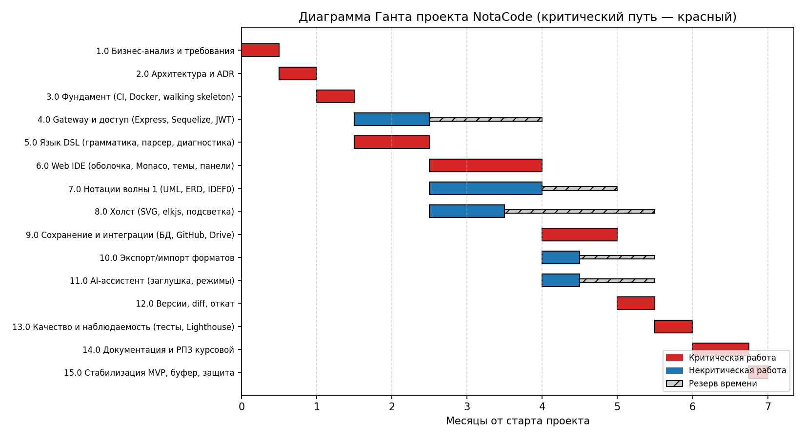
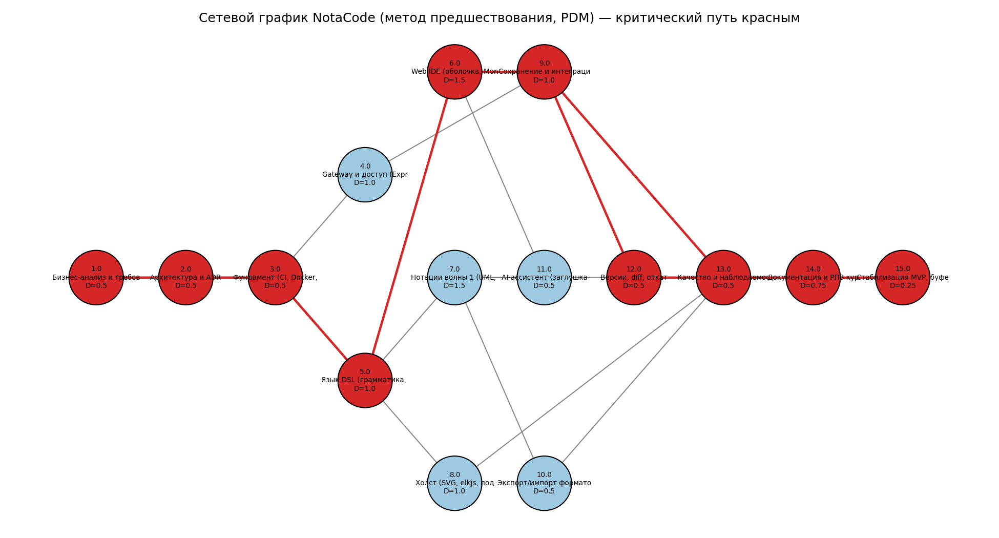

Министерство образования Республики Беларусь
Учреждение образования «Белорусский государственный университет информатики и радиоэлектроники»
Факультет повышения квалификации и переподготовки
Кафедра микропроцессорных систем и сетей

# ОТЧЁТ
по практическому занятию №4
по дисциплине «Управление проектами»
на тему «Диаграмма Ганта и сетевое планирование (метод критического пути)»

Проект: **NotaCode** — веб-IDE «diagram as code» для формальных нотаций моделирования

Слушатель гр. 60121 — `<ФИО>`
Руководитель — И.В. Кашникова

Минск, 2026

---

## 1. Иерархическая структура работ (WBS)

WBS построена укрупнением 13 продуктовых эпиков проекта NotaCode (E0–E13, см. `docs/planning/agile-plan.md §7`) до 15 работ верхнего уровня. Каждая работа имеет уникальный код в формате `N.0`.

**Название проекта:** NotaCode — веб-IDE для формальных нотаций моделирования на собственном DSL.

| Код | Название работы |
|---|---|
| 1.0 | Бизнес-анализ и требования (концепция, стейкхолдеры, SMART, BRD, SRS) |
| 2.0 | Архитектура и ADR (C4, модель данных, ревью) |
| 3.0 | Фундамент: монорепо, CI, Docker, walking skeleton (E0) |
| 4.0 | Gateway и доступ: Express, Sequelize, JWT (E1, ЛР1–3) |
| 5.0 | Язык DSL: грамматика, парсер, диагностика (E2) |
| 6.0 | Web IDE: оболочка, Monaco, панели, темы (E4) |
| 7.0 | Нотации волны 1: UML, ERD, IDEF0 и др. (E3) |
| 8.0 | Холст: SVG-рендер, elkjs, подсветка (E5) |
| 9.0 | Сохранение и интеграции: устройство, БД, GitHub, Drive (E7) |
| 10.0 | Экспорт/импорт форматов (E8) |
| 11.0 | AI-ассистент: заглушка, адаптеры, режимы (E9) |
| 12.0 | Версии, diff, откат (E6) |
| 13.0 | Качество и наблюдаемость: тесты e2e, Lighthouse, OTel (E12) |
| 14.0 | Документация и РПЗ курсовой (E13) |
| 15.0 | Стабилизация MVP, буфер, защита |

## 2. Длительность каждой работы

Длительности оценены экспертным методом (укрупнённо в месяцах, с учётом фактического темпа одного разработчика с AI-ассистентом). Формула PERT `(O + 4M + P) / 6` применена для оценки работы 6.0 (Web IDE, самая неопределённая по объёму задача): O = 1,0 мес., M = 1,5 мес., P = 2,5 мес. → D = (1,0 + 4·1,5 + 2,5) / 6 = 1,58 ≈ **1,5 мес.** (использовано округлённое значение).

| Код | Название работы | Длительность (мес.) |
|---|---|---|
| 1.0 | Бизнес-анализ и требования | 0.5 |
| 2.0 | Архитектура и ADR | 0.5 |
| 3.0 | Фундамент (CI, Docker, walking skeleton) | 0.5 |
| 4.0 | Gateway и доступ | 1.0 |
| 5.0 | Язык DSL | 1.0 |
| 6.0 | Web IDE | 1.5 |
| 7.0 | Нотации волны 1 | 1.5 |
| 8.0 | Холст | 1.0 |
| 9.0 | Сохранение и интеграции | 1.0 |
| 10.0 | Экспорт/импорт форматов | 0.5 |
| 11.0 | AI-ассистент | 0.5 |
| 12.0 | Версии, diff, откат | 0.5 |
| 13.0 | Качество и наблюдаемость | 0.5 |
| 14.0 | Документация и РПЗ | 0.75 |
| 15.0 | Стабилизация MVP, буфер, защита | 0.25 |

## 3. Взаимосвязи между работами

| Код работы | Название работы | Непосредственные предшественники |
|---|---|---|
| 1.0 | Бизнес-анализ и требования | — |
| 2.0 | Архитектура и ADR | 1.0 |
| 3.0 | Фундамент | 2.0 |
| 4.0 | Gateway и доступ | 3.0 |
| 5.0 | Язык DSL | 3.0 |
| 6.0 | Web IDE | 5.0 |
| 7.0 | Нотации волны 1 | 5.0 |
| 8.0 | Холст | 5.0 |
| 9.0 | Сохранение и интеграции | 4.0, 6.0 |
| 10.0 | Экспорт/импорт форматов | 7.0 |
| 11.0 | AI-ассистент | 6.0 |
| 12.0 | Версии, diff, откат | 9.0 |
| 13.0 | Качество и наблюдаемость | 7.0, 8.0, 9.0, 10.0, 11.0, 12.0 |
| 14.0 | Документация и РПЗ | 13.0 |
| 15.0 | Стабилизация MVP, буфер, защита | 14.0 |

## 4. Расчёт сетевого графика (метод критического пути, CPM)

Расчёт выполнен прямым и обратным проходом (скрипт `calc_and_charts.py`, продублирован в Excel макросом `modGanttCriticalPath.bas`).

| Код | Название | Длит. | Предш. | ES | EF | LS | LF | Резерв | Критич. |
|---|---|---|---|---|---|---|---|---|---|
| 1.0 | Бизнес-анализ и требования | 0.5 | — | 0.0 | 0.5 | 0.0 | 0.5 | 0.0 | **ДА** |
| 2.0 | Архитектура и ADR | 0.5 | 1.0 | 0.5 | 1.0 | 0.5 | 1.0 | 0.0 | **ДА** |
| 3.0 | Фундамент | 0.5 | 2.0 | 1.0 | 1.5 | 1.0 | 1.5 | 0.0 | **ДА** |
| 4.0 | Gateway и доступ | 1.0 | 3.0 | 1.5 | 2.5 | 3.0 | 4.0 | 1.5 | нет |
| 5.0 | Язык DSL | 1.0 | 3.0 | 1.5 | 2.5 | 1.5 | 2.5 | 0.0 | **ДА** |
| 6.0 | Web IDE | 1.5 | 5.0 | 2.5 | 4.0 | 2.5 | 4.0 | 0.0 | **ДА** |
| 7.0 | Нотации волны 1 | 1.5 | 5.0 | 2.5 | 4.0 | 3.5 | 5.0 | 1.0 | нет |
| 8.0 | Холст | 1.0 | 5.0 | 2.5 | 3.5 | 4.5 | 5.5 | 2.0 | нет |
| 9.0 | Сохранение и интеграции | 1.0 | 4.0, 6.0 | 4.0 | 5.0 | 4.0 | 5.0 | 0.0 | **ДА** |
| 10.0 | Экспорт/импорт форматов | 0.5 | 7.0 | 4.0 | 4.5 | 5.0 | 5.5 | 1.0 | нет |
| 11.0 | AI-ассистент | 0.5 | 6.0 | 4.0 | 4.5 | 5.0 | 5.5 | 1.0 | нет |
| 12.0 | Версии, diff, откат | 0.5 | 9.0 | 5.0 | 5.5 | 5.0 | 5.5 | 0.0 | **ДА** |
| 13.0 | Качество и наблюдаемость | 0.5 | 7.0, 8.0, 9.0, 10.0, 11.0, 12.0 | 5.5 | 6.0 | 5.5 | 6.0 | 0.0 | **ДА** |
| 14.0 | Документация и РПЗ | 0.75 | 13.0 | 6.0 | 6.75 | 6.0 | 6.75 | 0.0 | **ДА** |
| 15.0 | Стабилизация MVP, буфер, защита | 0.25 | 14.0 | 6.75 | 7.0 | 6.75 | 7.0 | 0.0 | **ДА** |

Полная таблица — [`img/cpm_table.csv`](img/cpm_table.csv).

**Расчётная длительность проекта: 7,0 месяцев.**

**Критический путь (10 из 15 работ, суммарный резерв = 0):**

`1.0 → 2.0 → 3.0 → 5.0 → 6.0 → 9.0 → 12.0 → 13.0 → 14.0 → 15.0`

Работы 4.0 (Gateway), 7.0 (Нотации волны 1), 8.0 (Холст), 10.0 (Экспорт/импорт), 11.0 (AI-ассистент) имеют положительный резерв (1,0–2,0 мес.) и не лежат на критическом пути — их можно задерживать в указанных пределах без влияния на общий срок проекта.

## 5. Диаграмма Ганта

Диаграмма Ганта построена по расчётным ES/EF; критические работы выделены красным, резерв времени — штриховкой.

## 6. Сетевой график (метод предшествования, PDM)

Сетевой график отображает работы как узлы, а зависимости — стрелками. Работы и связи критического пути выделены красным.

## 7. Выводы

Критический путь проходит через 10 из 15 работ и определяет минимальный срок проекта — 7 месяцев. Работы, не лежащие на критическом пути (Gateway, нотации волны 1, холст, экспорт/импорт, AI-ассистент), обладают резервом от 1,0 до 2,0 месяцев и могут выполняться с некоторым отставанием без влияния на общий срок — на практике это соответствует решению `agile-plan.md §12` направлять лабораторные работы через дорожку Expedite, не затрагивая критические продуктовые задачи (язык DSL, Web IDE, сохранение/интеграции, версии, качество, документация). Диаграмма Ганта по спринтам (Scrum-календарь) приведена отдельно в `docs/planning/agile-plan.md §9` — она отвечает на вопрос «что делаем на этой неделе», тогда как настоящий отчёт — сетевая модель по методу критического пути для расчёта минимального срока проекта в целом.
